# Courier Management System
## The courier management system is a web application built by using PHP and SQL

### -> It facilitates employees and admin to track all the parcels, deliveries and payment details.

### -> The web app is locally hosted using xampp server and database is managed by using xampp sql admin.

## Screenshots

1. Xampp server 
   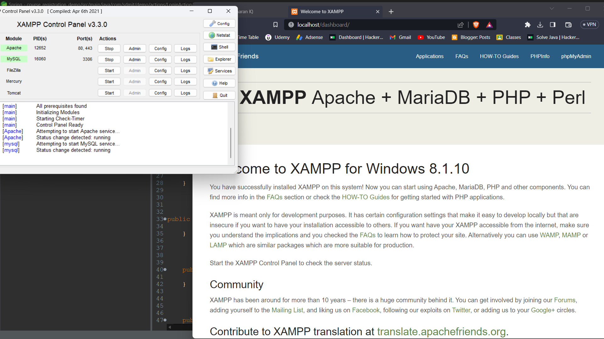
   Click on start apache and sql and open the admin views by clicking admin button

3. xampp sql database
      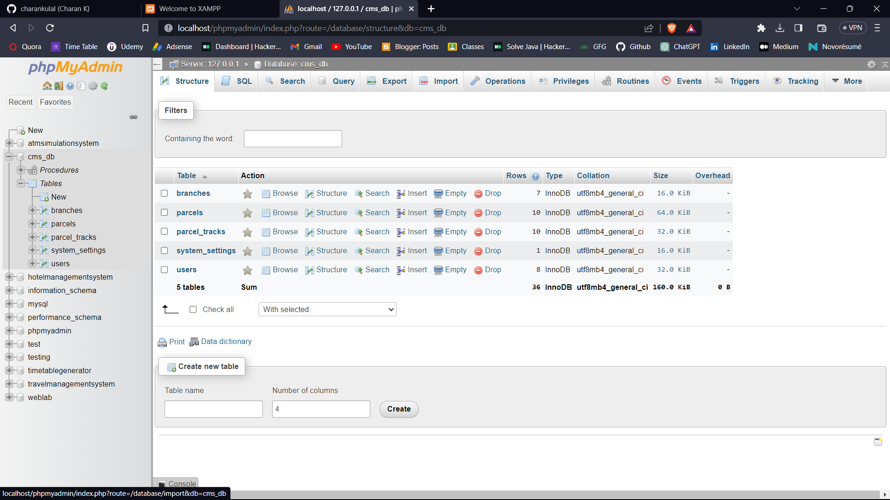

4. Login Page
      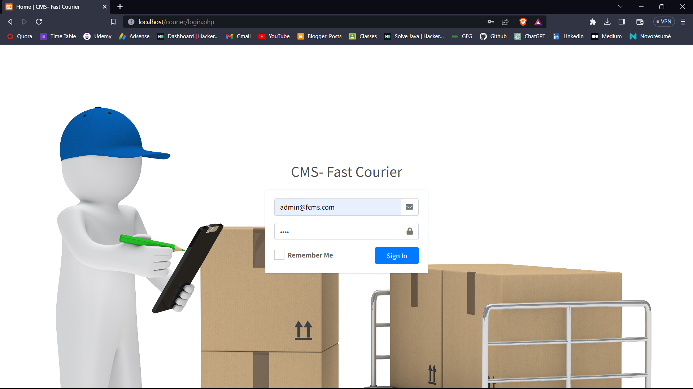

5. Admin Dashboard
       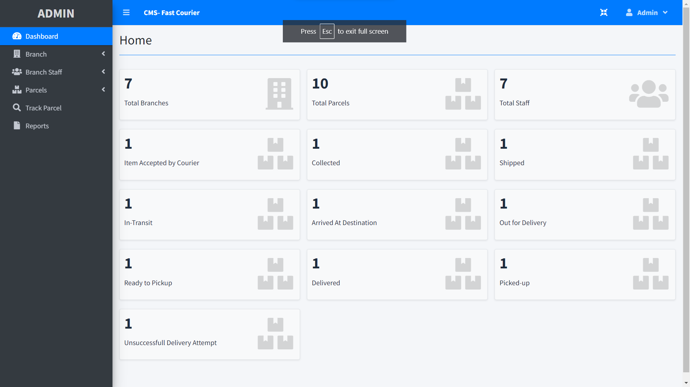

6. Add New Branch
       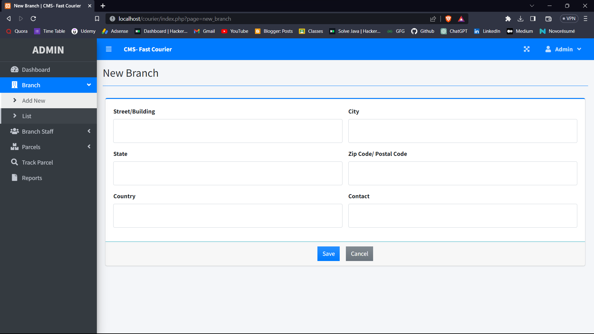

7. List All Branches
       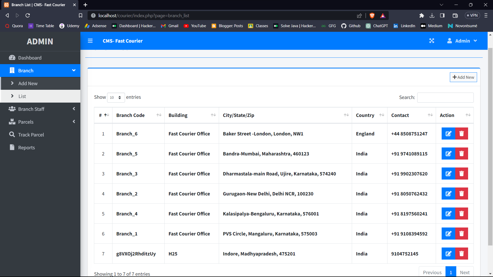

8. Edit Branch Details
       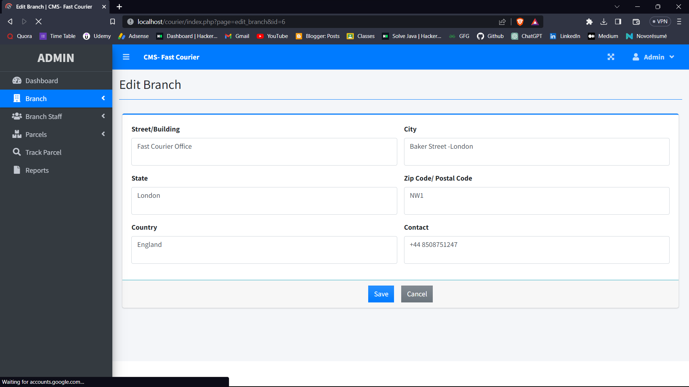

9. Add New Parcel
       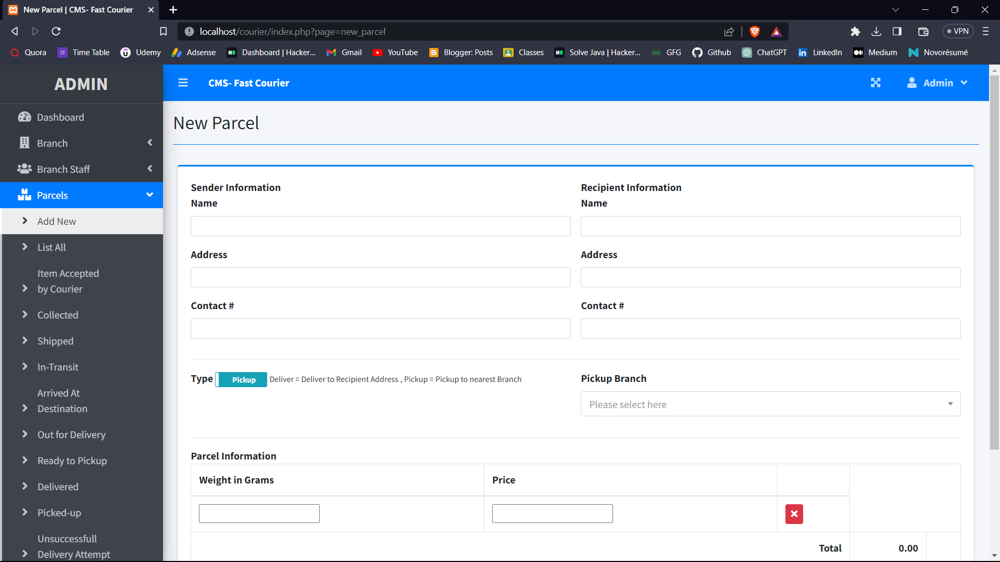

10. List All Parcels
       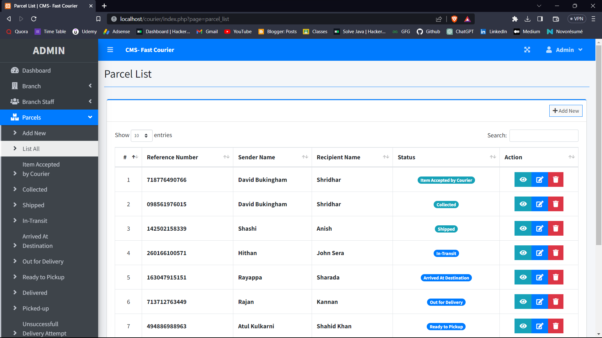

11. Add New Staff
       

12. List All the Staffs
       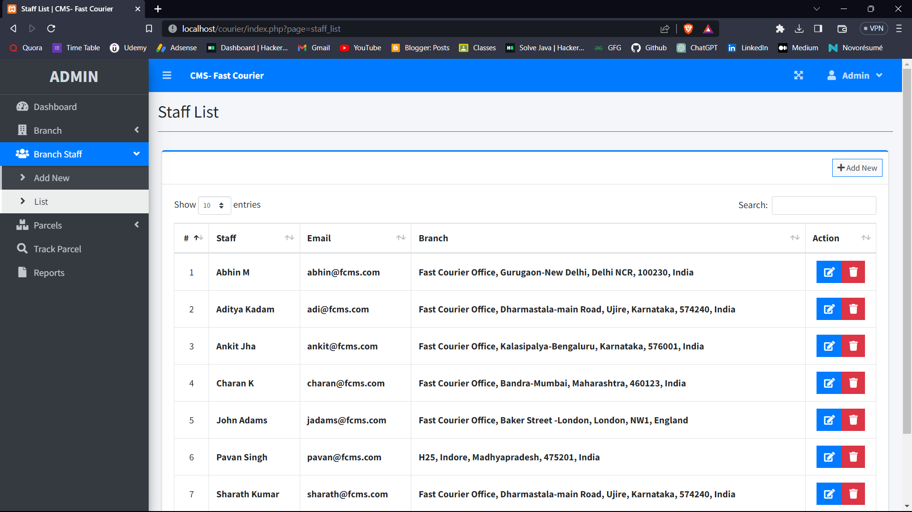

13. Edit staff Details
       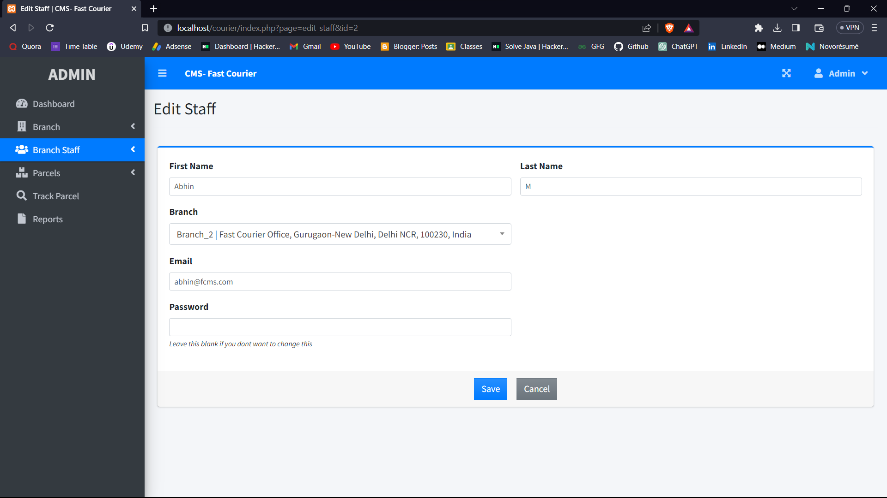

14. Track Parcels
       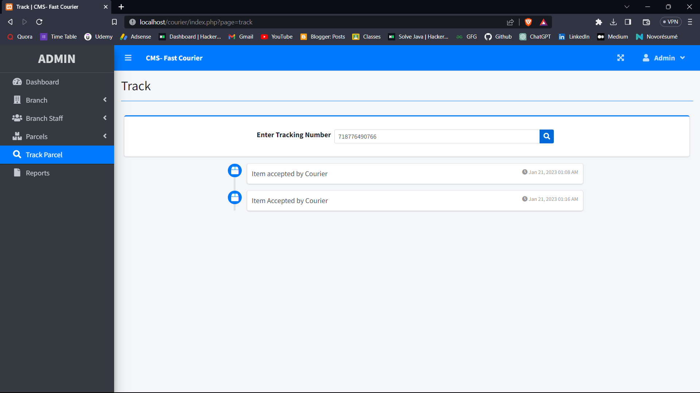

15. Report Page
       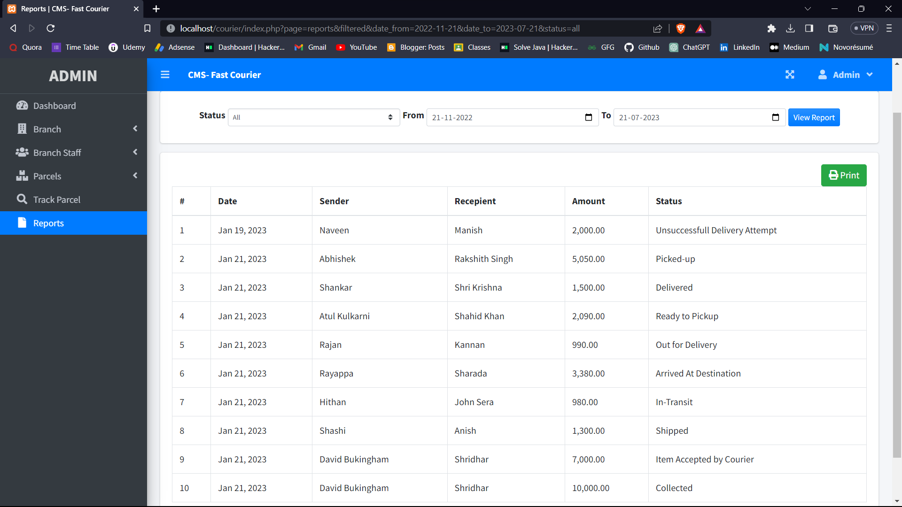   

16. Download or print the report
       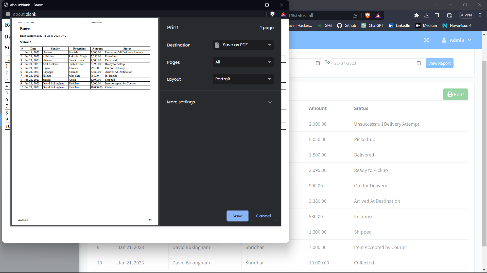

17. Employee Dashboard
       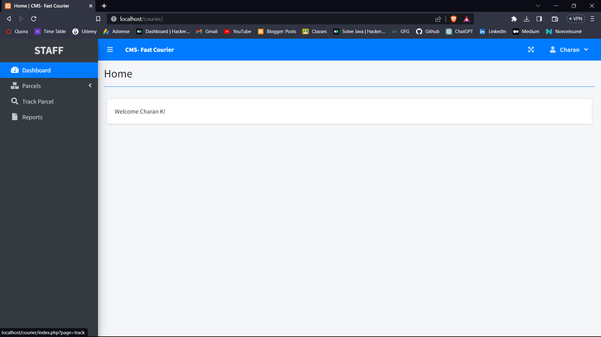

18. List of parcels in employee view
       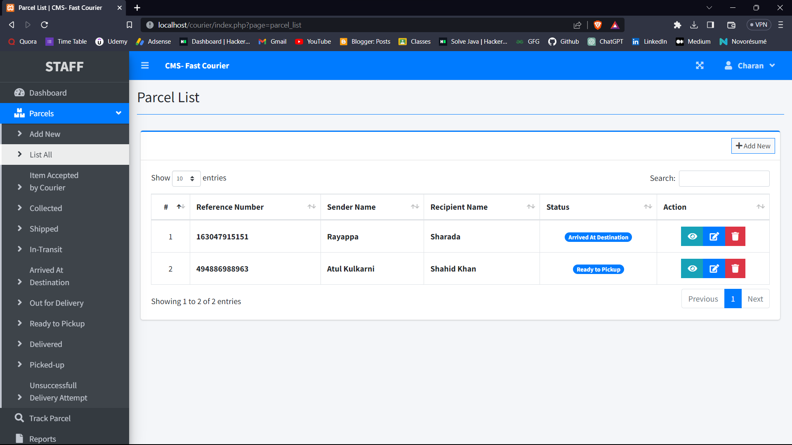

      
